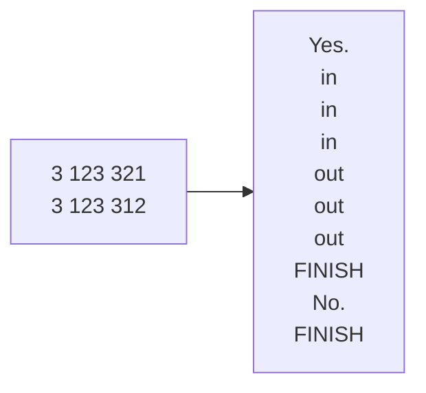

## 题目描述
某火车站只有一条铁轨供火车停靠，所有的列车都从一侧进入，从另一侧出来。如果此时，列车A首先进入铁路，然后列车B在列车A离开之前进入铁路，则列车A不能离开，直到列车B离开（如下图所示）。车站最多有9列火车，所有火车都有一个ID（编号从1到n），列车按照Order1的顺序进入铁路，你需要确定列车可以以Order2的顺序从地铁站离开。

## 样例

## 关键点
我读题发现可操作的只有出栈顺序，   
那么问题转化为每次入栈我是否要出栈    
是否出栈依赖于是否到他该出栈的时间  

## 步骤
1. 读题理解，入栈顺序固定，出栈顺序固定，要求不同出栈顺序，那么我操作的是入栈后何时出栈  
2. 画图分析，画123入栈，各种出栈情况，发现规律：入站栈入栈后成为入站栈顶，入站栈顶与出站栈顶比较，若相等则让刚入的元素出栈，然后比较新的栈顶  
3. 分析边界，题中火车有1-9个，不存在边界问题，出栈的边界是不为空   
4. 写伪代码，将画图操作具象化，检查漏洞，补充  
5. 写代码和注释，翻译伪代码即可  

## 错误
1. 没写成函数，导致很难看 -->习惯性错误，新功能要写成函数  
2. 用于判断所有元素是否都入过栈的计数器未迭代 -->第n次习惯性错误，不迭代  
3. 把入站栈的元素给出站栈初始化 -->习惯性错误，命名要能够分离，有意义，不是简单的序号区分  
4. 入站栈与出站栈的推入规则相反 -->思考时想到这一点，但写伪代码时忘记，写伪代码时同步记录数据状态，不能跳步  

## 关键代码
s1为入站栈，初始为空，s2为出站栈，初始满，len1是计数器，er存放步骤（反向）
```cpp
//退出条件，要么所有元素都入过栈，但栈没清空，要么已经满元素的出站栈被清空了
while(!s2.empty()&&len1<str1.length())
{
	s1.push(str1[len1]);
	len1++;
	er.push("in");
	//反复比较两栈栈顶元素是否相等
	//若相等则说明到他该出栈的时候了
	while (!s1.empty()&&s1.top()==s2.top())
	{
		s1.pop();
		s2.pop();
		er.push("out");
	}
}
```
